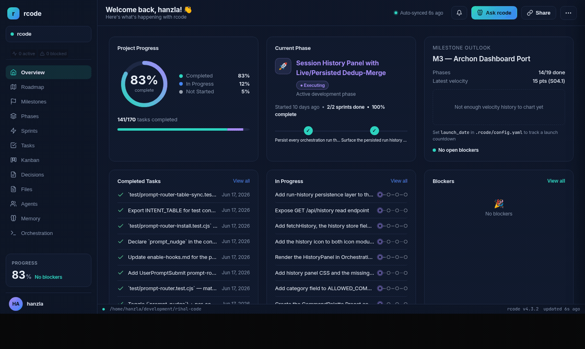
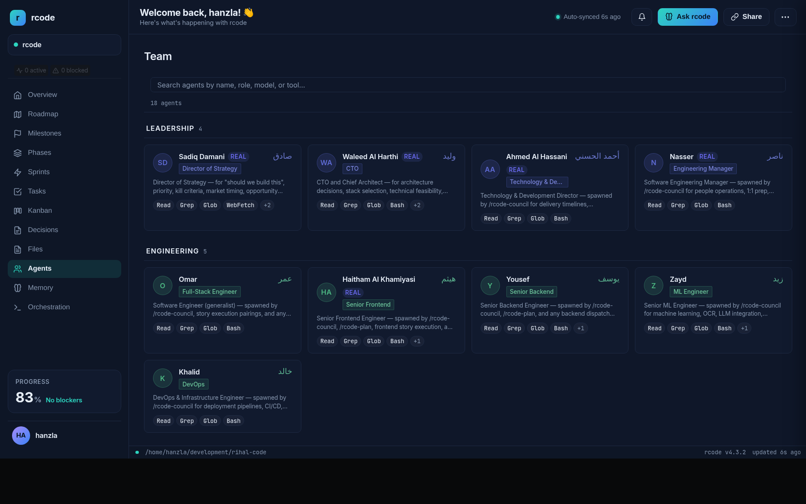
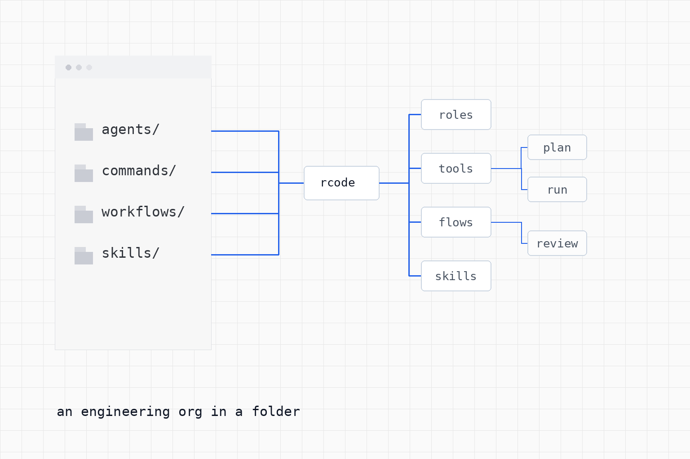
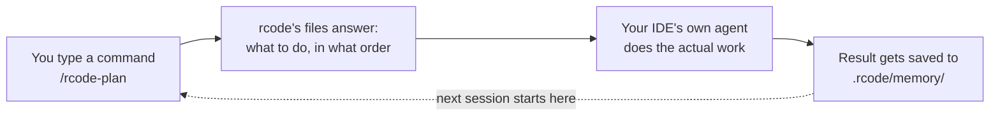
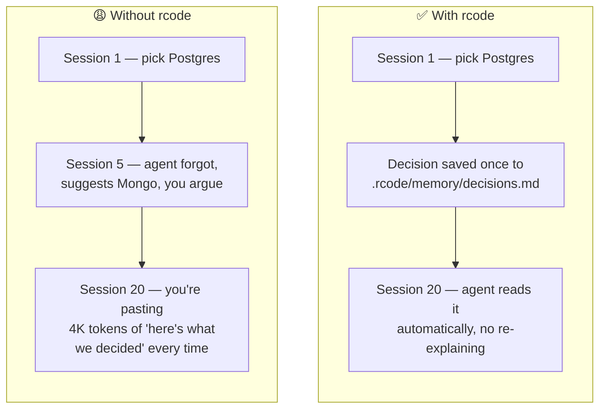
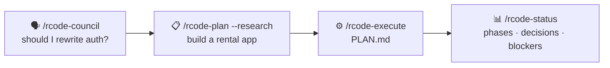

# rcode

<div dir="rtl">طريقة رحال</div>

<p align="center"></p>

### An engineering org in a folder — and you can watch it work.

*A roster of specialist agents, phase-driven delivery, and a persistent Memory Bank — running as plain files your IDE reads. **45 agents · 117 commands · 1 runtime dependency** — test count and CI status tracked by the badge above.*

<p align="center"></p>

<p align="center"><sub>The <a href="docs/install.md">Diwan dashboard</a> (<code>node server/dashboard.js</code>) — your project's phases, sprints, agents, decisions, and live orchestration, read straight from the files in <code>.rcode/</code>.</sub></p>

> **A curated composition of the best AI-development practices — shipped as files.** Surgical-change discipline, parallel-agent orchestration, persistent Memory Bank patterns, phase-driven planning — packaged as one workflow for Claude Code power users. No multi-agent harness. No vector DB. Your IDE keeps the methodology; the project keeps the memory.

```bash
pnpm dlx @hanzlaa/rcode install
```

[](https://www.npmjs.com/package/@hanzlaa/rcode)
[](https://www.npmjs.com/package/@hanzlaa/rcode)
[](https://github.com/hanzlahabib/rcode/actions/workflows/test.yml)
[](LICENSE)

Status: `@hanzlaa/rcode` v4.8.0 on npm. 45 agents · 117 commands · 130 workflows · **1 runtime dependency**. Test status tracked by CI badge above. Actively dogfooded on real projects every week.

---

## About the author

Built by [Hanzla Habib](https://github.com/hanzlahabib). rcode is a curated composition of the best public AI-development practices — surgical-change discipline, parallel-agent orchestration, persistent Memory Bank patterns, phase-driven planning — packaged as one workflow for Claude Code power users. Every workflow, agent, and skill in this repo was designed in dialogue with the same LLM you'll be running. The methodology shipped here is the one used to build rcode itself.

---

## Who builds this

One developer ([Hanzla Habib](https://github.com/hanzlahabib)) — building rcode **with** Claude, not just for it. Every workflow, agent, and skill in this repo was designed in dialogue with the same LLM you'll be running. The methodology shipped here is the one I use to build rcode itself.

That means two things:
- **The dogfood loop is the test suite.** Every release is run against fresh projects (calories-counter RN, reelspeed services) before publish. Bugs surface as GitHub issues, get fixed, ship.
- **The tool grows from real friction, not theory.** Half the v3.6.20 fixes came from a single dogfeed session where 3 parallel agents found 50+ real bugs in 4 hours.

If you're a solo dev or small team using Claude Code (or Cursor, Codex, VS Code), rcode gives you the **scaffolding a 10-person engineering org would have**: code review standards, sprint cadence, decision archives, onboarding context — without hiring the org.

---

## What it actually is

<p align="center"></p>

In plain words: **rcode is a folder of instructions your AI already knows how to read.** No new app to install, no server to run, no separate "agent brain" — just files. Your IDE (Claude Code, Cursor, whichever) is already an agent; rcode just hands it a really good playbook and a notebook that never forgets.



That loop — command in, memory out, memory feeds the next command — is the whole idea. Everything else in this repo is detail on top of that loop.

Three layers make it up:

| Layer | What lives here | Example |
|-------|-----------------|---------|
| **Memory** | `.rcode/memory/` — git-tracked markdown, lossless distillates | "We chose Postgres over Mongo because of JSON-B + RLS — see ADR-007" |
| **Skills** | `rcode/skills/` — 96 phrase-activated playbooks | `rcode-sprint-checker` validates file/symbol refs before execute |
| **Workflows** | `rcode/workflows/` — orchestrated multi-step paths | `/rcode-plan` runs research → planner → checker → confirm |

Single agent navigates the structure. No LangChain, no AutoGen, no orchestrator process. Just folders the model can read.

---

## Why I built it

I've shipped products solo for years and watched the same failure repeat in every project. In one sentence: **the AI forgets everything the moment the chat window closes, so I kept re-explaining the same decisions forever.**



That's it. That's the whole pitch. **Write the decision down once, in a file. The agent reads the file. Done.**

The same problem shows up at team scale, just wearing a different costume: onboarding a new hire takes 30 minutes of Slack archaeology, a late requirement quietly shifts the goalposts with no record of why, and six months later nobody remembers why the MVP was built the way it was. rcode's fix is the same either way — write the context down where the agent (and the next human) will actually see it.

---

## Concrete benefits

What you'll feel in week one:

- **No more re-explaining.** Decisions, blockers, conventions live in `.rcode/memory/` — agent reads them at session start automatically (~5K tokens, fully oriented).
- **Phased delivery without ceremony.** `/rcode-new-project` produces a roadmap with phases → sprints → tasks. `/rcode-plan` produces SPRINT.md files. `/rcode-execute` runs them with atomic commits. No Jira required.
- **No blank-page starts.** Already know you're building an API, a SaaS product, or a mobile app? `/rcode-from-template api-backend` seeds a real roadmap + requirements doc for that project type — edit it down instead of writing it up from nothing.
- **Specialist review on tap.** Want a Karpathy-style review of your last commit? `/rcode-review --karpathy`. Want a council debate on a decision? `/rcode-council should I rewrite auth?` — 5 agents answer in parallel, round 2 they challenge each other.
- **Intent guards.** Run the wrong command and get a one-line redirect, not a useless output.
- **Health check.** `rcode-tools health` returns JSON — milestone health, state snapshot, project status. Wire it into your dashboard.
- **Drift detection.** SEO-style drift baselines for any URL the project ships. Catches when somebody silently breaks your `<title>` or schema markup.

What you won't get:
- Magic. The agent still needs precise prompts; rcode just removes the boilerplate context-loading from each one.
- A productivity multiplier on a 200-line side project. You'll feel it on real work — multi-week, multi-contributor, multi-decision.

---

## What it isn't (anti-hype)

I dogfood this hard, so the honest version:

- **Not a chatbot wrapper.** Zero opinions about which LLM. Works with Claude Code, Cursor, Codex, VS Code, Antigravity, Windsurf. Bring your own keys.
- **Not a multi-agent framework.** No agent-to-agent message bus. One agent reads markdown structure and navigates it.
- **Not a no-code tool.** You will read markdown files. You will write commit messages. You will type slash commands.
- **Not finished.** v4 is solid for solo and small-team work. Open issues are tracked at the [issues page](https://github.com/hanzlahabib/rcode/issues) — most P1 bugs get fixed within 48 hours of a dogfeed run.
- **Not replacing senior engineers.** It gives you their scaffolding (review standards, sprint hygiene, decision archives). You still need judgment for the hard calls.

---

## How it stacks up

| | Cursor / Windsurf | CrewAI / AutoGen | LangChain / LlamaIndex | **rcode** |
|---|---|---|---|---|
| **Per-project memory** | Per-user, not git-tracked | Vector DB | Vector DB + chunking | Git-tracked markdown |
| **Specialist agents** | 1 generalist | Define in Python | Define in Python | 45 shipped |
| **Install** | IDE extension | `pip install` + config | `pip install` + code | `pnpm dlx` — one command |
| **Infrastructure** | Cloud API | Python server | Vector store + indexer | Zero — pure files |
| **IDE lock-in** | Cursor only | Framework-specific | Framework-specific | Claude / Cursor / Codex / VS Code / Antigravity / Windsurf |
| **Auditability** | Chat scrollback | Tracing dashboard | Tracing dashboard | `git log` |

The point isn't "I beat LangChain." The point is **you don't need LangChain for software delivery**. You need a methodology that survives session resets, and a methodology lives in files.

---

## By the numbers

> **Marketing teams round up. This repo ships the script.** Every figure below is computed by [`benchmarks/facts.cjs`](benchmarks/facts.cjs) from files on disk and local CLI timings — no network, no LLM calls, no hand-entered numbers. Clone the repo and run it:
>
> ```bash
> node benchmarks/facts.cjs
> ```

| Metric | Value | Why it's not a vanity number |
|---|---|---|
| **Portable methodology corpus** | **~105,000 lines** of markdown | A 10-person eng org's playbooks (agents + commands + workflows + skills + references) — as files you own and grep, not a SaaS you rent. |
| **Automated tests** | **598** across 74 files | The methodology is *guarded*, not vibes. Live pass/fail status is on the CI badge above; `node --test` (or `node benchmarks/facts.cjs`) reproduces locally in seconds. |
| **Tested CLI engine** | **~9,700 lines** (`rcode-tools.cjs` + `lib/`) | The deterministic brain — routing, state, planning math — is real code under test, not prompt soup. |
| **Runtime dependencies** | **1** (`ws`, for the dashboard socket) | The dashboard is otherwise pure Node stdlib. Almost nothing to audit, nothing to CVE-scan, nothing to break on `npm install`. |
| **Specialist agents / commands / workflows / skills** | **45 / 117 / 130 / 96** | An entire engineering org, phrase-activated, that travels with you across Claude Code, Cursor, Codex, VS Code, Antigravity, Windsurf. |
| **Core-op latency** | **~60 ms**, **0 LLM tokens** (best-of-7) | Intent routing, state reads, and milestone-health are deterministic *local* compute — a few ms over Node's own cold-start floor. The orchestration layer doesn't burn API tokens on bookkeeping the way pure-LLM agent frameworks do. |

> Counts above are produced by `node benchmarks/facts.cjs` and may drift slightly between releases — run it for the exact current figures.

**The headline:** an entire software-delivery methodology — ~105k lines of it — guarded by a real test suite, riding on a single runtime dependency, with an orchestration brain that costs **zero tokens** to think. Not a viral prompt. A system you can verify line by line.

---

## Quickstart

```bash
# 1. Install into any project (existing codebase or empty folder)
pnpm dlx @hanzlaa/rcode install

# 2. Restart Claude Code, then:
/rcode-init
```

> **Don't have pnpm?** We recommend pnpm to avoid peer-dependency resolution issues on npm 11.x and `npx` cache issues:
> `npm install -g pnpm`

`/rcode-init` detects your project state (fresh / existing / returning) and routes to the right first action. For a greenfield project it auto-routes to `/rcode-new-project`.

> **Want a status primer at the start of every session?** Run `/rcode-enable-hooks` to turn on a one-line project status readout (phase, plan progress, blockers) each time Claude Code starts in this project, plus 9 other opt-in guardrails (read-before-edit checks, dangerous-command blocking, auto-formatting). All off by default — a fresh install never surprises you.

### The full loop

Four commands cover most of a real week of work — decide, plan, build, check in:



| Command | What it does |
|---|---|
| `/rcode-council should I rewrite auth?` | 5 specialist agents debate it, 2 rounds — you get a decision, not a monologue |
| `/rcode-plan --research build a rental app` | A researcher grounds the plan in your real codebase, a checker verifies it before you build anything |
| `/rcode-execute .planning/plans/01/PLAN.md` | Runs the plan as atomic git commits, with pass/fail gates between steps |
| `/rcode-status` | One glance at phases, decisions, and blockers — no digging through chat history |

Full install flavors and IDE options: [`docs/install.md`](docs/install.md). Step-by-step first project: [`docs/getting-started.md`](docs/getting-started.md).

---

## What's next (roadmap)

The directions I'm building toward — open to PRs on any of these:

**Near-term (next 2 releases):**
- **Dialogue → pillars extractor.** Run a discussion, get back reusable voice/constraint/methodology MDs. `/rcode-discuss-phase` already captures decisions; this would distill *style* and *constraints* too.
- **User-level pillars** (`~/.rcode/pillars/`) for cross-project reuse — your voice, your review style, your testing standards live once, used everywhere.
- **Token telemetry.** Real per-response cost tracking via Claude Code's Stop hook (issue #745).
- **Slim agent split.** 6 agents currently exceed the 100-line lean target — splitting into role-focused variants.

**Mid-term:**
- **Cloud sync for Memory Bank** (opt-in) — so distributed teams share `.rcode/memory/` without merge conflicts.
- **Voice-controlled sessions** — drive rcode in a live meeting via voice; trigger workflows by keyword in conversation.
- **Multi-language docs** — Arabic-first, English mirrored. Currently the methodology is English-only with Arabic naming.

**Long-term direction:**
The bet: **methodology as a product**. Skills, workflows, and agents become a portable "engineering org in a folder" that travels with you across projects, IDEs, and LLM vendors. The methodology outlives any specific model.

The non-goal: building yet another agent framework. There are enough. rcode stays files.

---

## Honest state of things

- **v4.8.0** is the current release — Memory Bank now ships populated by default, brain-pull is live, and 50+ bug fixes landed from the most recent 3-project dogfeed run.
- **Open issues**: ~50 — half are feature requests, the rest are backlog bugs ranked by severity.
- **Test suite**: 598 automated tests across 74 files (run `node --test`). Live pass/fail status is on the CI badge above. Coverage is structural (compliance + artifact schema + workflow behavioral), not line-coverage.
- **Real users**: I run it on 4 projects daily. A handful of others run it on theirs. If you find a bug, file it — most P1s ship within 48 hours.
- **Funding**: none. This is solo work. If your company wants commercial support, [email me](mailto:hanzla.dev@gmail.com).

---

## Why "rcode"

رحّال (Rihāl) means "traveler" in Arabic — someone who carries knowledge between places. The persona names (Sadiq, Waleed, Fatima, Hussain, etc.) are Arabic placeholders. Swap them for your team in `rcode/team.yaml`. The methodology is the persona, not the names.

Named for the Arabic root **رحال** (rahhal) — the traveler. rcode walks alongside your code as a persistent companion across sessions.

---

## Learn more

| Document | What's in it |
|---|---|
| [`DOCS.md`](DOCS.md) | Complete docs — install, concepts, all commands, Memory Bank, dashboard, testing, architecture |
| [`docs/getting-started.md`](docs/getting-started.md) | Step-by-step first project |
| [`docs/TIERS.md`](docs/TIERS.md) | Starter / Advanced / Power-user paths |
| [`docs/dogfeed-flows.md`](docs/dogfeed-flows.md) | Live dogfeed log — every Q&A flow, every bug found, every fix shipped |
| [`MEMORY_BANK.md`](MEMORY_BANK.md) | Memory Bank specification |
| [`BRAND.md`](BRAND.md) | Naming, voice, persona glossary |
| [`CHANGELOG.md`](CHANGELOG.md) | Release history |

---

## 💙 Feedback welcome

rcode is built and maintained by one person. If you hit a rough edge, a confusing command, or anything that doesn't work — please share it. Every report, even a one-liner, makes the tool better for everyone.

**Post an issue in 30 seconds → [github.com/hanzlahabib/rcode/issues/new](https://github.com/hanzlahabib/rcode/issues/new)**

Quick template:
```
Title:  what you were trying to do
Body:   what happened vs what you expected
        + the command or phrase you used
```

Thank you for using rcode. 🙏

---

## Credits

- [Andrej Karpathy's coding observations](https://github.com/forrestchang/andrej-karpathy-skills) (MIT) — wired into the code-review agents as hard constraints.
- Built solo with [Claude Code](https://claude.com/claude-code) — the methodology shipped here is the one used to build it.

---

## License

Released under the [MIT License](LICENSE). Use it, fork it, ship it.
