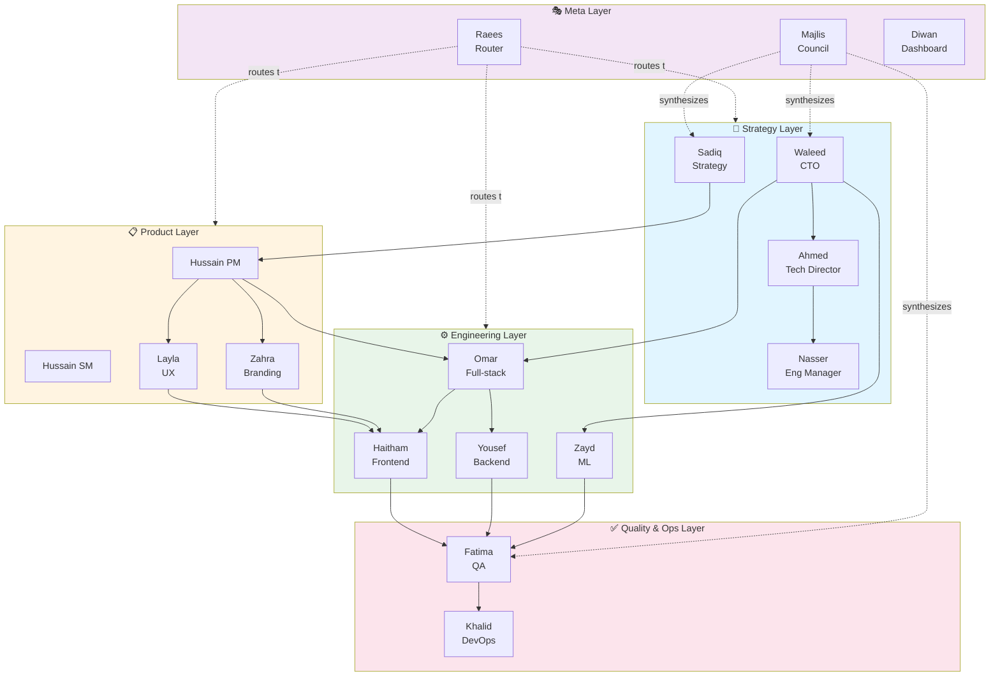
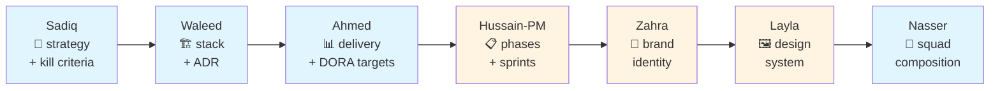
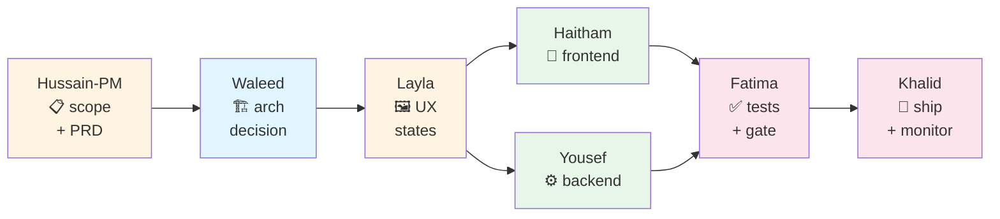
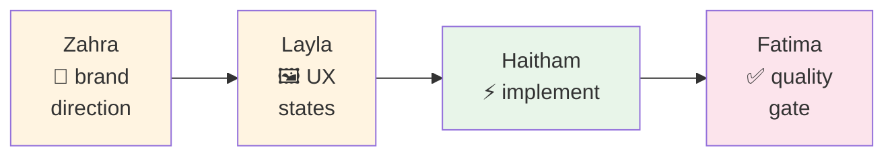
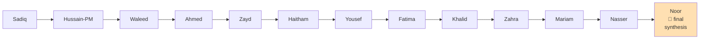
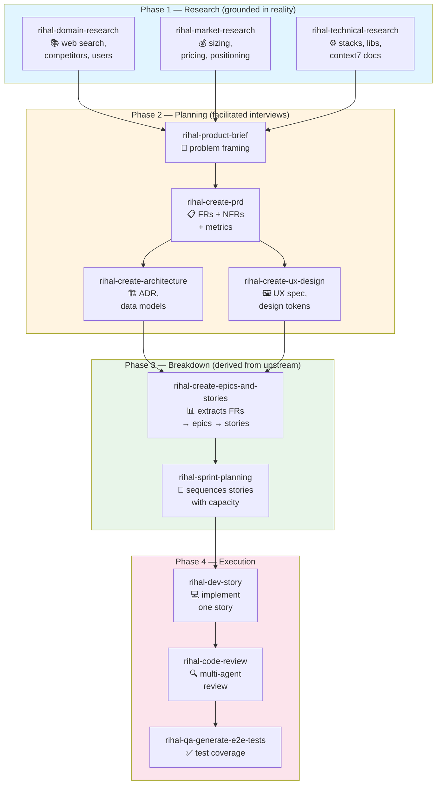
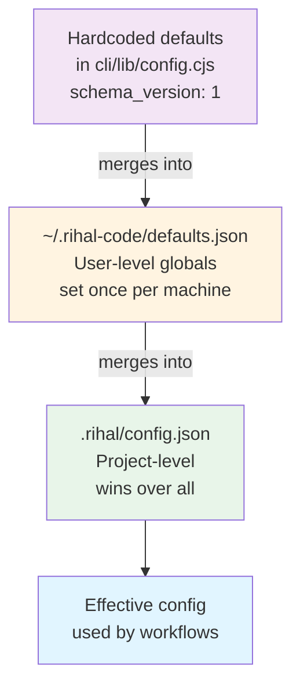
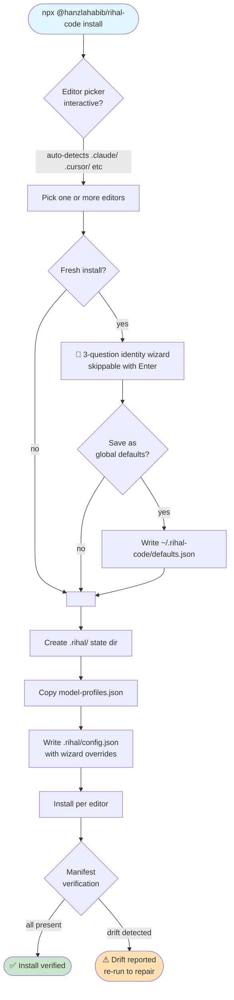

# Rihal Code

<div dir="rtl">طريقة رحال</div>

> **A context-aware AI team methodology inspired by Rihal (Muscat, Oman).**
> 19 specialized agents. 4 specialized pipelines. File-based state. Works across Claude Code, Cursor, Windsurf, Antigravity, and any AGENTS.md-compatible tool.

---

## What is this

Most AI coding tools give you one assistant pretending to be everything. **Rihal Code gives you a real team** — 19 agents with clear roles, authorities, and decision boundaries. You run them individually, in predefined pipelines for common work types, or as a full council for cross-domain strategic questions.

It's not a chatbot. It's a methodology — file-based state in `.rihal/`, config that every workflow reads, and a contract so each agent knows exactly what they own.

```bash
# One command. Zero npm dependencies. Works in any project.
npx @hanzlahabib/rihal-code install
```

---

## Why "Rihal"

[Rihal](https://rihal.om) is one of Oman's fastest-growing tech companies (Series A 2025, 270+ employees, 2,441% growth). The agent names are Arabic placeholders inspired by real team roles at Rihal. You can swap them for your own team in `rihal/team.yaml`.

---

## Quick start — 90 seconds

```bash
# In any project directory
npx @hanzlahabib/rihal-code install

# A wizard asks 3 questions (all skippable with Enter)
#   Your name or team name [Team]: Hanzla Habib
#   Communication language [English]: Urdu
#   Document output language [English]:
#   Save these as global defaults for future projects? [y/N]: y

# Now restart your editor (Claude Code / Cursor / Windsurf / Antigravity)
# and try:

/rihal:help                     # See everything available
/rihal:project "tasbeeh app"    # Kickoff a new project end-to-end
/rihal:feature "add dark mode"  # Build one feature end-to-end
/rihal:ui "redesign login"      # UI/UX pipeline
/rihal:council "should we rewrite in Go?"   # 13-agent strategic council
@waleed "review this architecture"          # Invoke one agent
```

That's it. No boilerplate, no cloud setup, no API keys.

---

## The team — 19 agents

<sup>Each has a full `SKILL.md` with persona, authority, principles, and domain. Lean 20-line digests live in `rihal/digests/` and get loaded by pipeline commands without pulling the full skill.</sup>

### Strategy & Leadership
| Agent | Arabic | Role |
|---|---|---|
| **Sadiq** | صادق | Business Analyst / Strategy — business direction, kill criteria |
| **Waleed** | وليد | CTO / System Architect — stack, architecture, ADRs |
| **Ahmed Al Hassani** | أحمد | Technology & Development Director — delivery, DORA |
| **Nasser** | ناصر | Engineering Manager — squad composition, ops |

### Product & Design
| Agent | Arabic | Role |
|---|---|---|
| **Hussain (PM)** | حسين | Product Manager — PRDs, scope, metrics |
| **Hussain (SM)** | حسين | Scrum Master — sprint ops, retros, flow |
| **Layla** | ليلى | UX Designer — flows, states, accessibility |
| **Zahra** | زهراء | Branding Director — visual identity, design system |

### Engineering
| Agent | Arabic | Role |
|---|---|---|
| **Omar** | عمر | Full-stack Engineer — general implementation |
| **Haitham Al Khamiyasi** | هيثم | Frontend Engineer — UI implementation, a11y |
| **Yousef** | يوسف | Backend Engineer — APIs, data, infra |
| **Zayd** | زيد | ML Engineer — models, evals, pipelines |

### Quality & Ops
| Agent | Arabic | Role |
|---|---|---|
| **Fatima** | فاطمة | Test Architect (QA) — testing, release gates |
| **Khalid** | خالد | DevOps — CI/CD, infra, monitoring |

### Content & Comms
| Agent | Arabic | Role |
|---|---|---|
| **Noor** | نور | Technical Writer — docs, presentations |
| **Mariam** | مريم | Marketing — GTM, positioning, copy |

### Meta
| Agent | Arabic | Role |
|---|---|---|
| **Raees** | رئيس | Orchestrator — routes requests to specialists |
| **Majlis** | مجلس | The Council — multi-agent synthesis |
| **Diwan** | ديوان | Dashboard — view-only transparency |

---

## Architecture

### Agent authority hierarchy



---

### Pipeline commands (predefined agent chains)

Rihal Code ships with 4 specialized pipelines. Each runs a fixed sequence of agents, streaming each agent's response live with handoff lines between them. You see what's happening as it happens — not a batched wall of text at the end.

#### `/rihal:project <name>` — full kickoff pipeline

Use this when nothing exists yet. Strategy → architecture → delivery → scope → brand → design system → team.



#### `/rihal:feature <description>` — build one feature

Use this when requirements exist but need breakdown, build, test, and ship. Scope → arch → UX → FE + BE → tests → ship.



#### `/rihal:ui <task>` — UI/UX pipeline

Use for new components, screen redesigns, brand alignment, accessibility audits, Arabic RTL work, motion/interaction design.



#### `/rihal:council <question>` — 13-agent strategic council

Use for cross-domain decisions, crisis response, or questions nobody can own alone. Each agent reads prior responses before adding their own position. Sequential to avoid content-policy issues and keep the flow coherent.



---

### Planning workflow — how epics/stories actually get made

Rihal Code's creation workflows are **grounded, not hallucinated**. Each step reads real upstream artifacts before emitting anything. If an upstream doc is missing, the skill refuses and tells you what to run first.



**Key guarantee:** `rihal-create-epics-and-stories` will refuse to run if no PRD exists — it tells you to run `rihal-create-prd` first. No hallucinated requirements. No made-up stories. Every downstream doc cites its upstream source.

---

### Configuration cascade

Config values (`user_name`, `communication_language`, `output_folder`, `model_profile`, etc.) resolve through three layers. Later layers override earlier ones.



Run `rihal-code config` to see which source each value came from:

```
   key                       value           source
   ------------------------  --------------  ------
   project_name              tasbeeh-app     project
   user_name                 Hanzla Habib    user
   communication_language    Urdu            user
   document_output_language  English         default
   model_profile             balanced        project
```

---

### Install flow



---

## Directory layout

### Package (what npx installs from)
```
rihal-code/
├── cli/                         # All CLI commands (Node.js, zero deps)
│   ├── index.js                 # Entry — routes to subcommands
│   ├── init.js                  # Install command
│   ├── uninstall.js             # Uninstall with tar backup
│   ├── config.js                # Config get/set/list
│   ├── set-profile.js           # Model profile switcher
│   ├── doctor.js                # Preflight + compliance check
│   ├── github-sync.js           # Sync phases/epics/stories → GitHub
│   └── lib/
│       ├── config.cjs           # 3-level cascade loader
│       ├── prompts.cjs          # Zero-dep readline wrapper
│       ├── fsutil.cjs           # Atomic writes
│       ├── manifest.cjs         # Install verification
│       ├── github.cjs           # gh CLI wrapper
│       └── model-profiles.cjs   # Model profile resolver
├── rihal/
│   ├── config.yaml              # Package metadata
│   ├── config/
│   │   └── model-profiles.json  # quality / balanced / budget / inherit
│   ├── digests/                 # 19 lean 20-line agent summaries
│   ├── skills/
│   │   ├── agents/              # 17 agent SKILL.md files
│   │   ├── actions/             # 23 action skills (create-prd, epics, etc.)
│   │   └── core/                # utility skills (help, brainstorming, etc.)
│   └── templates/               # GitHub issue/epic/story/bug templates
└── server/
    └── dashboard.js              # Diwan dashboard (view-only, zero deps)
```

### Project state (created by install)
```
your-project/
├── .rihal/                       # Project state — git-friendly
│   ├── config.json               # Canonical config (this is the one)
│   ├── model-profiles.json       # Copy of the profile table
│   ├── state.json                # Auto-generated project state
│   ├── phases/                   # Phase briefs, sprints, stories
│   ├── plans/                    # Implementation plans
│   ├── decisions/                # ADRs
│   ├── artifacts/                # Design system, pitches, research
│   ├── progress/                 # Status reports, standups, retros
│   ├── context/
│   │   └── active.md             # Compacted context for AI
│   └── backups/                  # Auto-created on uninstall
├── .claude/skills/rihal-*        # 17 agent + 23 action skills (if Claude picked)
├── .claude/commands/rihal/       # 16 slash commands
├── .cursor/rules/rihal-*.mdc     # 19 Cursor rules (if Cursor picked)
├── .windsurf/rules/rihal-*.mdc   # Same for Windsurf
├── .antigravity/agents/rihal-*   # Same for Antigravity
├── AGENTS.md                     # Universal AGENTS.md (always)
└── CLAUDE.md                     # Project starter (Claude only)
```

---

## How to use it — common scenarios

### Scenario 1: Brand-new project

```bash
mkdir my-new-app && cd my-new-app
npx @hanzlahabib/rihal-code install
# (go through wizard, pick all editors)
```

Then in your editor:

```
/rihal:project "my-new-app — a tool that helps Omani SMBs track zakat"
```

This runs the kickoff pipeline. **13 agents discuss sequentially.** Each reads prior responses. By the end you have:
- Strategic positioning and kill criteria (Sadiq)
- Stack decision with ADR saved to `.rihal/decisions/` (Waleed)
- Delivery plan with DORA targets (Ahmed Al Hassani)
- Phased roadmap with sprint targets (Hussain PM)
- Brand identity direction (Zahra)
- Design system baseline (Layla)
- Squad composition recommendation (Nasser)

### Scenario 2: Adding a feature to an existing project

```
/rihal:feature "add Arabic RTL support across the app"
```

Pipeline: Hussain-PM scopes it → Waleed decides if architectural changes are needed → Layla designs the states → Haitham + Yousef implement → Fatima gates → Khalid ships.

### Scenario 3: Just a UI task

```
/rihal:ui "redesign the zakat calculator screen for mobile"
```

Shorter pipeline: Zahra brand direction → Layla UX → Haitham implementation → Fatima quality gate.

### Scenario 4: Strategic question nobody can own alone

```
/rihal:council "Should we rewrite the sync engine in Go, or stay with TypeScript?"
```

All 13 agents weigh in sequentially. Noor does final synthesis.

### Scenario 5: Just invoke one specialist

```
@waleed "Review this database schema for scalability"
@fatima "Write test cases for this authentication flow"
@sadiq "Is this feature worth building?"
```

### Scenario 6: You're stuck, not sure what to do

```
/rihal:progress      # situational awareness
/rihal:next          # advance to next logical step
/rihal:discuss       # facilitated pre-council framing
```

### Scenario 7: Bug hunting

```
/rihal:fix "users report the app freezes when submitting"
```

Systematic debugging workflow — reproduces, isolates, fixes, adds regression test.

### Scenario 8: Quick atomic task

```
/rihal:quick "add a health check endpoint at /api/health"
```

One-shot, one commit, done.

### Scenario 9: Sync planning to GitHub

```bash
# Dry run (default — shows the plan, no mutations)
rihal-code github-sync

# Actually push
rihal-code github-sync --execute
```

This creates/updates GitHub milestones (phases), epics (issues with `type:epic` label), and stories (issues with `type:story` label) following the Rihal GitHub standards taxonomy (23 labels). Idempotent — re-runs only touch changed content (tracked via SHA-256 content hash in `.rihal/integrations/github-map.json`).

---

## CLI commands

```bash
# Install / uninstall
rihal-code install [--editor=all|claude|cursor|...] [--yes]
rihal-code uninstall [--keep-state] [--delete-state] [--yes]

# Configuration
rihal-code config                              # show all effective values + source
rihal-code config <key>                        # get one value
rihal-code config <key> <value>                # set in .rihal/config.json
rihal-code config --global <key> <value>       # set in ~/.rihal-code/defaults.json

# Model profile (shortcut for `config model_profile`)
rihal-code set-profile [quality|balanced|budget|inherit]
rihal-code show-model                          # show which model each agent uses

# Health & dashboard
rihal-code doctor                              # preflight + compliance
rihal-code dashboard                           # start Diwan dashboard on :7717
rihal-code team                                # list team roster
rihal-code digest                              # compact agent digests

# GitHub integration
rihal-code github-sync                         # dry-run sync (default)
rihal-code github-sync --execute               # actually mutate GitHub
```

---

## Configuration reference

`.rihal/config.json` — every key, every default:

```json
{
  "schema_version": 1,
  "project_name": "your-directory-name",
  "user_name": "Team",
  "communication_language": "English",
  "document_output_language": "English",
  "output_folder": ".rihal",
  "planning_artifacts": ".rihal/phases",
  "project_knowledge": ".rihal/context",
  "model_profile": "balanced"
}
```

| Key | Purpose |
|---|---|
| `schema_version` | For future config migrations |
| `project_name` | Used in all generated docs; defaults to `cwd` basename |
| `user_name` | How agents address you |
| `communication_language` | Chat language (agents speak this) |
| `document_output_language` | Generated doc language |
| `output_folder` | Root for all generated artifacts |
| `planning_artifacts` | Where phases/epics/stories land |
| `project_knowledge` | Long-term context directory |
| `model_profile` | `quality`, `balanced`, `budget`, or `inherit` |

### Model profiles

```bash
rihal-code show-model
```

| Profile | Top agents | Budget agents | Cost vs quality |
|---|---|---|---|
| **quality** | opus everywhere | — | Most expensive, highest fidelity |
| **balanced** | opus for strategy, sonnet for impl | haiku for scribes | Recommended default |
| **budget** | sonnet for leads, haiku for most | haiku everywhere | Cheapest with acceptable quality |
| **inherit** | whatever the host tool chooses | — | Let Claude Code / Cursor decide |

Switch profile:
```bash
rihal-code set-profile quality
```

---

## Multi-editor support

One install, every compatible tool picks it up:

| Editor | Install path | How it's loaded |
|---|---|---|
| **Claude Code** | `.claude/skills/rihal-*` + `.claude/commands/rihal/` | Auto-discovered on session start |
| **Cursor** | `.cursor/rules/rihal-*.mdc` | Auto-discovered via Cursor rules |
| **Windsurf** | `.windsurf/rules/rihal-*.mdc` | Auto-discovered via Windsurf rules |
| **Antigravity** | `.antigravity/agents/rihal-*.md` | Follows AGENTS.md spec |
| **Any other AGENTS.md tool** | `AGENTS.md` at project root | Universal spec |

The install command detects which editor directories already exist and preselects them in the picker. You can also pick them explicitly:

```bash
rihal-code install --editor=claude
rihal-code install --editor=all
```

---

## Troubleshooting

### `rihal-code doctor`
Runs 6 preflight checks before you hit a broken install at runtime:

```
Preflight:
   ✓ Node.js ≥ 18           v24.7.0
   ✓ .rihal/ writable       /path/to/project/.rihal
   ✓ model-profiles.json    4 profiles (quality, balanced, budget, inherit)
   ✓ git CLI                available
   ✓ gh CLI                 available (github-sync ready)
   ✓ Agent manifest         claude:17 claude:23 cursor:19 windsurf:19 antigravity:19

Package compliance:
   ✓ All 40 skills compliant with 5-component standard

✅ All checks passed.
```

If manifest drift is detected (missing or extra agents from a partial install), doctor reports exactly what's off and exits non-zero. Re-run `install` to repair.

### Install was interrupted mid-copy
The install runs manifest verification at the end. If some skill dirs didn't land (disk full, Ctrl+C, permission issue), you'll see:

```
⚠ Install verification found drift:
   ⚠ claude       agents   16/17
      missing: waleed-architect
Re-run install to repair, or run 'rihal-code doctor' for details.
```

Just re-run `rihal-code install` — it's idempotent, only missing pieces get copied.

### You want to undo an install
```bash
rihal-code uninstall
```

This:
1. Shows a preview of everything that will be touched
2. Asks for confirmation
3. Creates a timestamped tar.gz backup at `.rihal/backups/uninstall-{ISO}.tgz`
4. Removes skill files from all editor dirs
5. Strips the Rihal section from `AGENTS.md` (never deletes the file)
6. Removes empty editor shell dirs (but never your own content)
7. Asks separately before touching `.rihal/` (your project data)

Restore is a single command — the success message prints it:
```bash
tar -xzf .rihal/backups/uninstall-2026-04-10T19-08-03.tgz
```

### Config got into a weird state
```bash
rihal-code config                # see all values + source
rihal-code config user_name      # get one
rihal-code config user_name "New Name"    # fix it
```

Or edit `.rihal/config.json` directly — it's just JSON.

### Agent responds with wrong persona
Make sure the agent's SKILL.md is actually installed. Check:
```bash
ls .claude/skills/ | grep rihal-
rihal-code doctor
```

---

## Philosophy

> **Strategy without execution is hallucination. Execution without strategy is drift. Rihal Code forces both.**

- **Sadiq asks "why?"** before Waleed asks "how?"
- **Waleed locks the stack** before Omar writes code
- **Hussain scopes features** before anyone commits
- **Layla designs states** before Haitham wires them
- **Zahra sets the brand** before Layla picks colors
- **Fatima gates releases** before Khalid deploys
- **Noor documents** before knowledge walks out the door
- **Majlis synthesizes** when no one can own the answer alone
- **Diwan shows everything** so nothing hides in someone's head

The methodology enforces these through pipelines. You can't skip Sadiq on a `/rihal:project` call. You can't bypass Fatima on `/rihal:feature`. The chain is the contract.

---

## Customization

### Replace agent names with your real team
Edit `.rihal/team.yaml` (or the package-level `rihal/team.yaml` for global changes). The SKILL.md personas read names from here.

### Change cultural elements
`rihal/config.yaml` — greetings, language, dashboard port, context thresholds.

### Add your own skill or agent
Drop a new skill dir under `.claude/skills/rihal-your-skill/` with a valid `SKILL.md`. Doctor will flag it on next run. Or contribute it upstream.

### Override model per agent
Edit `.rihal/model-profiles.json` — you can override individual agent→model bindings within any profile.

---

## Contributing

See `CONTRIBUTING.md` for commit conventions (Conventional Commits enforced), the 5-component skill standard, and PR guidelines.

---

## License

UNLICENSED — internal use. Contact the author to license for your organization.

## Author

**Hanzla Habib** — Frontend engineer at Rihal. Built this to stop AI assistants from forgetting what role they're playing and making up requirements from thin air.

<div dir="rtl">صُنع بحب في مسقط — Made with love in Muscat (in spirit)</div>
