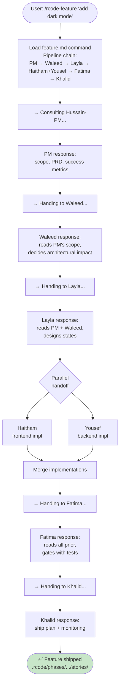
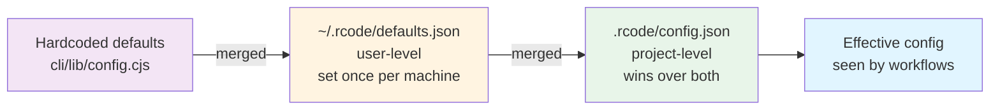
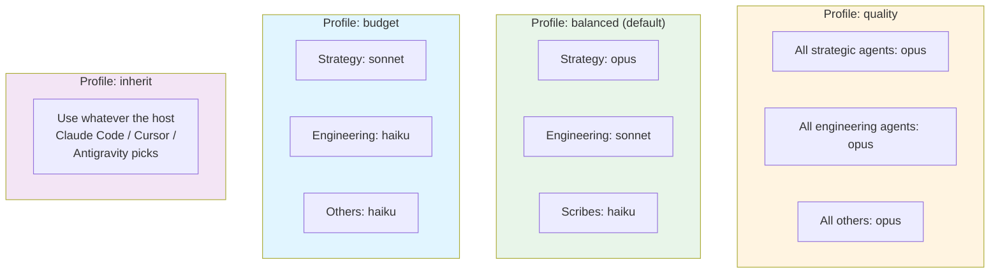
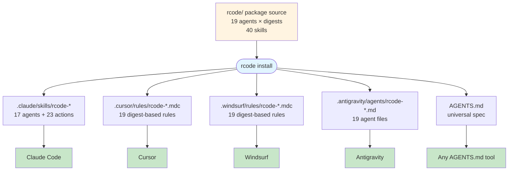

# rcode — Deep Dive

This is the **why** behind rcode. For the **how** (installation, CLI commands, pipeline syntax), see the [README](../README.md).

---

## The Problem

AI coding assistants have a context problem. They either:

1. **Remember too much** — stale information contaminates new decisions
2. **Remember too little** — every session starts from scratch
3. **Remember the wrong things** — irrelevant code blocks eat the context budget

And most AI workflows give you **one assistant** — a generalist who has to be strategy, PM, engineer, designer, QA, and DevOps simultaneously. No real team works that way. One generalist collapses into mush: vague advice, hedged opinions, no sharp edges.

## The Solution

rcode applies five ideas:

1. **Specialized agents with real authority boundaries** — each agent owns a domain and defers outside it
2. **File-based state** that survives between sessions (`.rcode/`)
3. **Upstream-grounded workflows** — creation skills refuse to run without their upstream artifacts (no hallucinated requirements)
4. **Pipeline contracts** — predefined agent chains for common work types (project/feature/UI/council)
5. **Context cascading config** — hardcoded → user → project, so you configure once and inherit everywhere

---

## 19 agents, not 9

The original design had 9 agents. Real team work surfaced gaps. The current shape:

### Strategy (4)
**Sadiq** (strategy), **Waleed** (CTO), **Ahmed Al Hassani** (tech director), **Nasser** (eng manager)

### Product & design (4)
**Hussain-PM** (product), **Hussain-SM** (scrum), **Layla** (UX), **Zahra** (brand)

### Engineering (4)
**Hanzla** (full-stack generalist), **Haitham** (frontend), **Yousef** (backend), **Zayd** (ML)

### Quality & ops (2)
**Fatima** (QA), **Khalid** (DevOps)

### Content & comms (2)
**Noor** (writer), **Mariam** (marketing)

### Meta (3)
**Raees** (orchestrator/router), **Majlis** (council synthesis), **Diwan** (dashboard)

**Why this split?** Because specialization produces sharper outputs than generality. Haitham writing frontend differs from Yousef writing backend differs from Zayd writing evals. Asking one agent to do all three dilutes each.

### Authority map

Authority flows down from strategy. Each agent **defers** to others on their domain, and **has final say** within theirs.

```
                     Sadiq (why)
                         │
                    ┌────┴────┐
                    │         │
               Waleed (how)  Hussain-PM (what/when)
                    │              │
              ┌─────┼─────┐    Layla ◀── Zahra
              │     │     │         │
           Hanzla  Haitham  Yousef ◀── │
              │     │     │         │
              └─────┼─────┘
                    │
               Fatima (gate)
                    │
               Khalid (ship)
                    │
               Noor (document)

Meta: Raees routes, Majlis synthesizes, Diwan shows
```

No agent overrides another on their home turf. When a decision spans domains, it escalates to **Majlis** (the council) where everyone weighs in sequentially.

---

## The `.rcode/` state directory

This is the project's **persistent brain**. Everything lives here — git-friendly, editor-inspectable, offline-ready.

```
.rcode/
├── config.json             # canonical project config (read by every workflow)
├── model-profiles.json     # model assignments (quality / balanced / budget / inherit)
├── state.json              # current project phase + active agents
├── phases/                 # phase briefs, epics, stories
│   └── phase-01/
│       ├── brief.md
│       ├── epics.md        # output of rcode-create-epics-and-stories
│       ├── sprints.md
│       └── stories/
├── plans/                  # implementation plans per feature
├── decisions/              # ADRs (chronological, numbered)
├── artifacts/
│   ├── brand/              # design system, brand assets
│   ├── reviews/            # code review outputs
│   ├── research/           # domain/market/technical research
│   └── bugs/               # bug reports
├── progress/               # daily logs, retros, status reports
├── integrations/
│   └── github-map.json     # local ↔ GitHub sync state (idempotent)
├── backups/                # auto-created by uninstall (tar.gz)
└── context/
    └── active.md           # compacted context under 2k tokens
```

### Why file-based?

1. **Git-native** — state is versioned with code
2. **Inspectable** — any editor can read it, `cat` works
3. **Portable** — no database to migrate, no vendor lock-in
4. **Offline-first** — works on a plane
5. **AI-friendly** — markdown is the universal AI format
6. **Forensic** — you can go back and see exactly what the team decided on any date
7. **Diffable** — PR reviews show config changes alongside code changes

---

## Grounded creation — no hallucinated requirements

The biggest failure mode of AI planning is the generalist confidently emitting epics and stories from nothing. rcode forbids this structurally.

```mermaid
graph TD
    Start([User: create epics]) --> Check{PRD exists<br/>in .rcode/phases/?}
    Check -->|no| Refuse([❌ Refuse<br/>'Run rcode-create-prd first.<br/>I cannot invent requirements.'])
    Check -->|yes| Extract[Read PRD<br/>extract FRs, NFRs]
    Extract --> ArchCheck{Architecture<br/>exists?}
    ArchCheck -->|yes| ReadArch[Merge architecture<br/>requirements]
    ArchCheck -->|no| SkipArch[Continue without<br/>architecture constraints]
    ReadArch --> UXCheck{UX spec<br/>exists?}
    SkipArch --> UXCheck
    UXCheck -->|yes| ReadUX[Merge UX-DR<br/>requirements]
    UXCheck -->|no| Confirm
    ReadUX --> Confirm[Present extracted<br/>requirements to user]
    Confirm --> Decompose[Decompose into<br/>3-6 epics × 3-8 stories]
    Decompose --> Write[Write .rcode/phases/{n}/epics.md<br/>with frontmatter citing<br/>inputDocuments]
    Write --> Done([✅ Done — every story<br/>cites its upstream FR])

    style Refuse fill:#ffcdd2
    style Done fill:#c8e6c9
```

The chain is enforced at every step. You can't run epics before PRD. You can't run sprint-planning before epics. You can't run dev-story before sprint-planning. If an agent tries to invent content upstream of its authority, it refuses and points to the correct command.

---

## Context management

Context quality beats context quantity. A 2k-token brief of *the right things* outperforms a 50k-token dump of everything.

### Context budget per task type

| Task type | Load | Don't load |
|---|---|---|
| Feature build | `active.md` + feature brief + similar pattern | Unrelated modules |
| Bug fix | `active.md` + bug report + failing path + related ADR | Entire codebase |
| Refactor | `active.md` + target file + importers | Unrelated features |
| Code review | `active.md` + diff + related ADRs | Unchanged code |
| Docs | `active.md` + feature + audience notes | Implementation details |
| Strategy | `active.md` + market research + OKRs | Code |

### The `active.md` compaction rule

Every time context drifts, the previous session gets compacted into `context/active.md`. Rules:

1. **Under 2k tokens** — strict budget
2. **Append-only** for decisions (you can always scroll back)
3. **Phase-scoped** — old phases archive, current phase stays live
4. **Machine-readable** — structured so agents can extract specific sections without reading the whole thing

### Context reset workflow

```
1. Save current session state → .rcode/progress/session-{date}.md
2. Compact everything → .rcode/context/active.md (under 2k tokens)
3. /clear the AI context
4. Tell AI: "Read .rcode/context/active.md ONLY"
5. Resume work with a lean brain
```

---

## The pipeline contract

Pipelines aren't just "call a bunch of agents in order." They're **contracts** — each agent reads prior responses before adding their own, and the handoff is visible to the user.



**Live streaming:** each agent's response is printed as it's generated, with `→ Consulting {agent}...` handoff lines between them. You see the flow, not a batched wall of text at the end.

**Sequential, not parallel:** this is deliberate. Parallel multi-agent calls trigger content policy issues and produce incoherent synthesis. Sequential with visible handoffs gives each agent a chance to read prior responses and build on them.

---

## Configuration cascade — configure once, inherit everywhere

Real teams work on many projects. Retyping `user_name` and `communication_language` for every project is friction. The config cascade fixes this:



First install offers a wizard. If you say "save as global defaults," your answers land in `~/.rcode/defaults.json`. Every future project inherits them as the defaults in the wizard, so you just hit Enter through and get your preferences automatically.

Project-level config always wins — so a specific project can say "this one is in Arabic" without changing your global.

---

## Model profiles — balance quality vs cost

Different agents deserve different models. Sadiq asking "should we do this at all?" benefits from Opus. Noor writing release notes does fine with Sonnet. Utility agents like Diwan can run on Haiku.



Switch at any time: `rcode set-profile budget`. Override per-agent by editing `.rcode/model-profiles.json`.

---

## Multi-editor — one install, every tool

The same install populates every compatible editor's discovery path:



The interactive picker auto-detects which editor directories already exist and preselects them, so you almost never type anything.

---

## The Diwan dashboard (ديوان)

### Why view-only?

Because CRUD is where projects break:

- Someone edits state, another agent's state becomes stale
- Schema migrations lag the code
- Multi-writer scenarios need locks; locks need coordination
- Bugs in write logic corrupt state permanently

**The dashboard never writes.** It reads `.rcode/` files on a 5-second interval. If you want to change something, you run a workflow — which updates files — and the dashboard reflects the new state on the next tick.

### What it shows

- Current phase + active agents (top stats)
- Active context (what AI currently knows — renders `active.md`)
- Full team roster (19 agents, active ones highlighted)
- Phases (briefs, epics, stories, sprints)
- Decisions (ADRs chronologically)
- Progress (latest 10 entries)
- Artifacts (design system, pitches, research, reviews)

### Design choices

- **Omani palette** — rcode blue `#1e3a8a` + gold `#f59e0b`
- **Dark mode only** — because terminals
- **Bilingual** — Arabic + English signage
- **No JS framework** — single Node.js file, no build step, no deps
- **5-second polling** — fast enough to feel live, slow enough to not thrash disk
- **Zero runtime dependencies** — pure Node stdlib

---

## Differentiation

### vs single-agent frameworks (Cursor rules, Continue, Aider)

These give you one assistant. rcode gives you a structured team with authority boundaries. If your work needs *"which technology?"* and *"which user?"* and *"which test?"* answered by the same person, single-agent is fine. If those are three different people in real life, you want rcode.

### What makes rcode different

Defining traits that separate rcode from adjacent skill-driven AI methodology tools:

- **Zero npm dependencies** — pure Node stdlib installer; no `@clack/prompts` or similar runtime deps to pull on install
- **Multi-editor native** — installs to Claude Code, Cursor, Windsurf, Antigravity, and AGENTS.md simultaneously, not Claude-only
- **Atomic writes + verification** — state files are written atomically (tempfile + fsync + rename) with manifest verification after install to catch partial states
- **Timestamped uninstall backup** — every destructive operation creates a tar.gz first
- **Config cascade with user-level** — `~/.rcode/defaults.json` lets you configure identity once per machine, then per-project overrides
- **Cultural framing** — bilingual Arabic-English from day one; Arabic agent names with cultural identity baked in
- **Pipeline streaming protocol** — each agent's response surfaces live with handoff lines; no batched wall of text

### vs generic AI agent frameworks (LangGraph, CrewAI, AutoGen)

Those are toolkits. You build your team. rcode is **the team, already built**, opinionated about roles, authorities, and the `.rcode/` state layout. Less flexible, more out-of-the-box value.

---

## When to use rcode

**Good fit:**

- Team projects with multiple roles that need coordination
- Long-running initiatives (weeks to months)
- Projects mixing strategy + technical + design work
- Projects where decisions need to be traceable (ADRs, audit trails)
- Teams where "who decides what" needs clarity
- Multi-project developers who want consistency across repos

**Bad fit:**

- Single-file scripts
- One-off prototypes you'll throw away next week
- Projects that fit entirely in your head
- Pure ML research where the output is a notebook

If your project is under 10 files or will be thrown away in a week, rcode is overkill. Use it for real work that ships and lasts.

---

## The core loop

```
1. Kickoff
   /rcode-project "name"
   → Sadiq → Waleed → Ahmed → PM → Zahra → Layla → Nasser
   → .rcode/phases/phase-01/brief.md
   → .rcode/decisions/001-stack.md
   → .rcode/artifacts/brand/
   → .rcode/artifacts/design-system/

2. Plan a sprint
   /rcode-kickoff (for a new phase inside an existing project)
   → .rcode/phases/phase-{n}/sprints.md

3. Build features
   /rcode-feature "description"
   → Hussain-PM → Waleed → Layla → Haitham + Yousef → Fatima → Khalid
   → Code committed, tests passing, deployed

4. UI work
   /rcode-ui "task"
   → Zahra → Layla → Haitham → Fatima

5. Strategic questions
   /rcode-council "question"
   → 13 agents sequential, Noor synthesizes

6. Context reset (as needed)
   /rcode-progress then manually compact active.md
   → .rcode/context/active.md

7. Bug hunting
   /rcode-fix "issue"
   → Systematic debug, root cause, fix, regression test

8. Quick tasks
   /rcode-quick "task"
   → One-shot atomic commit

9. GitHub sync
   rcode github-sync --execute
   → Creates/updates milestones, epics, stories from .rcode/phases/

10. Dashboard (anytime)
    rcode dashboard
    → http://localhost:7717
```

---

## Final note

This methodology is opinionated. That's on purpose. If you disagree with the opinions, fork it and make it yours — but don't water it down. Methodologies become useless when they try to please everyone. rcode trades flexibility for sharp edges, and that's the point.

<div dir="rtl" style="text-align:center;margin-top:40px;font-size:18px;">
رحلة البناء
</div>

*The journey of building.*
